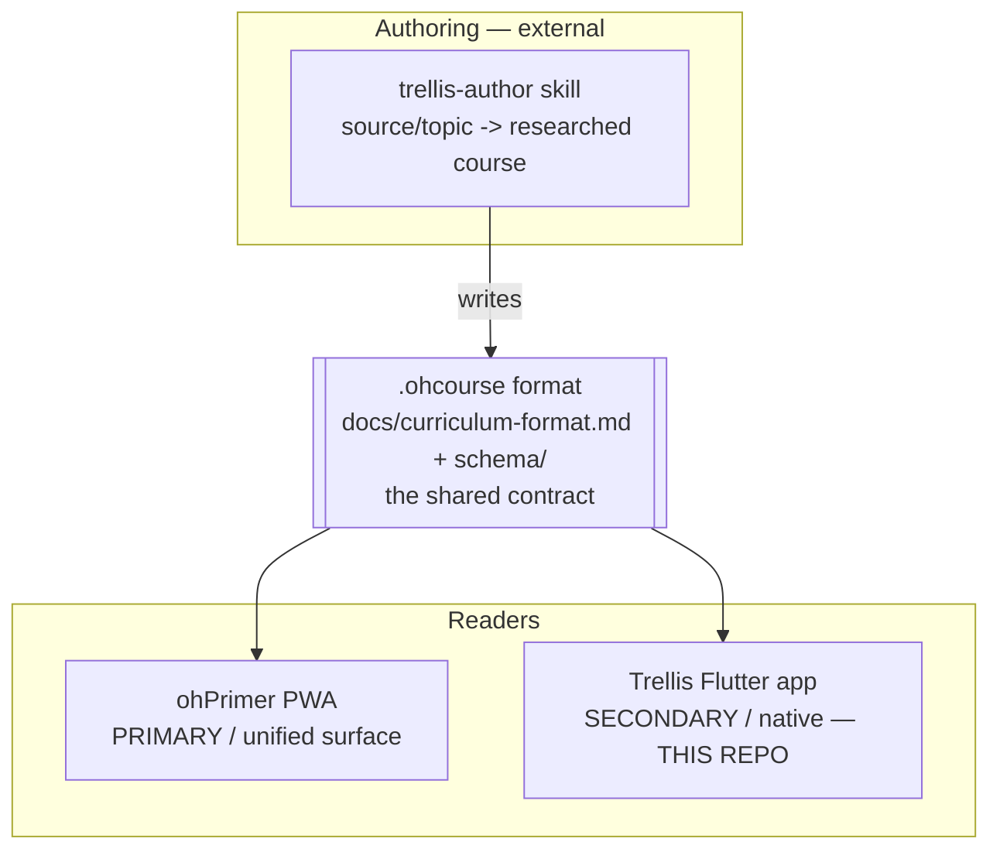
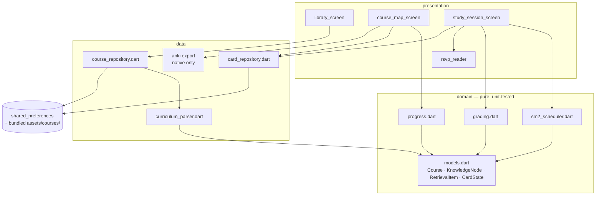
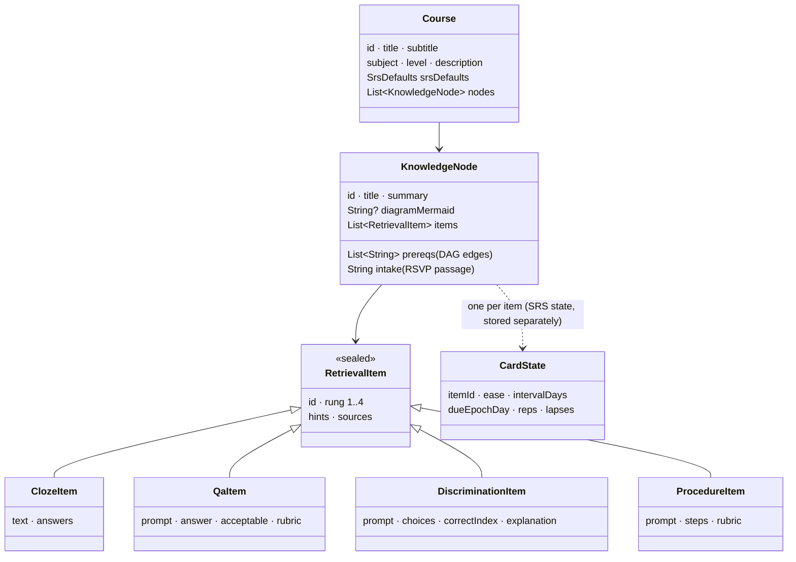
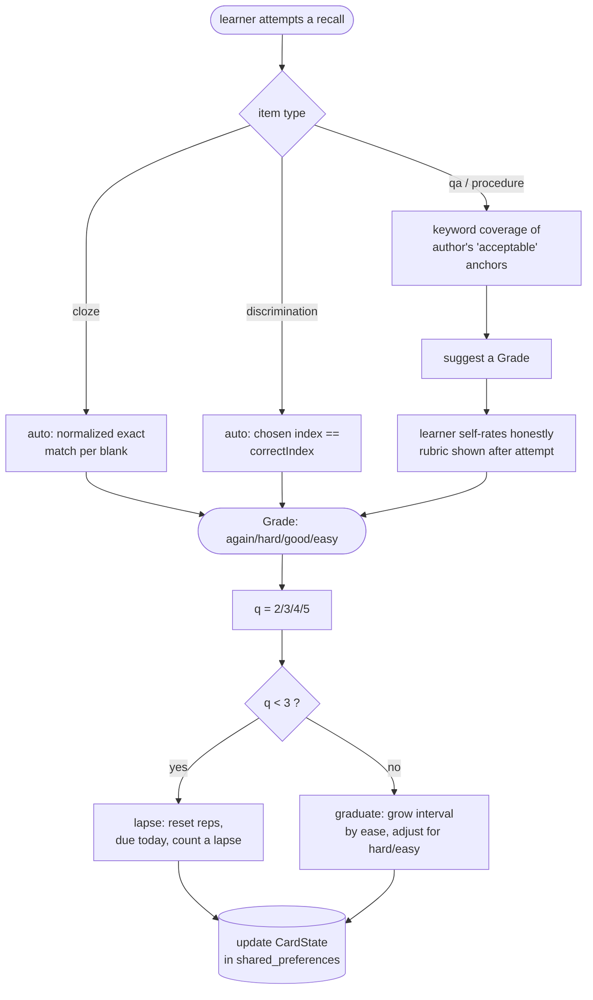

# Architecture Overview

> The one-page mental model of Trellis, then the diagrams that make it concrete.
> For *why* each load-bearing decision was made, see [`docs/adr/`](../adr/). For the
> `.ohcourse` format itself, see [`docs/curriculum-format.md`](../curriculum-format.md).

## What this is, in one paragraph

Trellis is a **local-first, native (Flutter) spaced-repetition reader**. You import
an `.ohcourse` file — a versioned JSON curriculum that is a **prerequisite DAG of
concepts**, each with a dense *intake* passage and a difficulty-laddered set of
*retrieval items*. The app parses and validates it, shows a **course map** (mastery
per concept, prerequisite locks, what's due), and runs a **study session**: RSVP-read
a concept, recall each of its due items, grade the recall, and let **SM-2** schedule
the next review. Mastery advances and **unlocks downstream concepts**. Everything —
courses and all study progress — lives on the device; the app makes no network calls
of its own. It is the *native* surface of the Trellis line; the *primary* surface is
the **ohPrimer** PWA, and both read the same `.ohcourse` format.

## The loop (the single most important picture)

Read this and you understand 80% of the app. Everything else is plumbing around it.

```mermaid
flowchart LR
    src([any source / a topic]) -. authored offline by the<br/>trellis-author skill .-> file[[.ohcourse file<br/>versioned JSON]]
    file --> imp[import + parse + validate]
    imp -- malformed --> rej([reject with a<br/>path-qualified error])
    imp -- ok --> map[Course map<br/>DAG · mastery · locks · due]
    map --> study[Study session]
    subgraph study [Study session — per due node]
      intake[RSVP intake<br/>ORP pivot, WPM] --> recall[recall each due item<br/>up the rung ladder]
      recall --> grade[grade<br/>auto or self-rate]
      grade --> sched[SM-2 schedules<br/>the next review]
    end
    sched --> prog[mastery advances]
    prog -- prereqs mastered --> unlock[unlock downstream concepts]
    unlock -.-> map
```

Two facts to hold onto:

1. **The `.ohcourse` file is a contract, not a config.** It carries a
   `schemaVersion` the parser gates on, its prereq edges must reference real nodes
   and form a DAG (no cycles), and a malformed file is *rejected*, never
   half-imported. See [ADR-0003](../adr/0003-ohcourse-shared-contract.md).
2. **Retrieval is cue-laddered.** Each item's `rung` (1–4) ≈ how much you must
   generate from memory; the scheduler graduates you up it. Recall, not
   recognition, is the product. See [ADR-0004](../adr/0004-retrieval-first-sm2.md).

## Where it sits (the Trellis line)

Trellis is one **reader** among the three pieces of the Trellis knowledge engine.
It does not author courses and it is not the canonical surface.

- The **format** is the seam. A course authored once studies the same way in either
  reader. Keeping this true is a first-order concern — see
  [ADR-0006](../adr/0006-native-secondary-to-ohprimer.md).
- This repo is *only* the native reader. Format or loop changes belong upstream in
  the shared contract (and ohPrimer), not forked here.

## The layers (Clean-ish Architecture per feature)

Two features — `curriculum` (courses) and `study` (the recall loop) — each split
`domain / data / presentation`. `core/` holds cross-cutting helpers. State is
Riverpod; persistence is `shared_preferences`.

- **Riverpod** wires it together (`core/providers.dart`): a `SharedPreferences`
  instance is resolved in `main()` and injected; `courseRepositoryProvider`,
  `cardRepositoryProvider`, and a `coursesProvider` hang off it.
- **`domain` is pure and I/O-free.** The scheduler, grading, and progress math take
  data and return data — no clocks (time is passed in as a whole epoch-day), no
  storage, no widgets. That's what makes them unit-testable.
- **`data` owns the outside world:** parsing untrusted JSON, reading bundled assets,
  and `shared_preferences` I/O.

## The data model (what a course *is*)

- `RetrievalItem` is a **sealed class** with four subtypes — an exhaustive `switch`
  in the parser and the UI means a new item type won't compile until every site
  handles it. That's the fail-loud posture in the type system.
- **Course content is immutable and comes from the file.** Per-item SRS
  (`CardState`) is *separate* mutable state, keyed by `itemId`, held in
  `shared_preferences`. Scheduling is in whole days since the Unix epoch (UTC), so
  the app is timezone-stable and the scheduler is deterministic.

## Grading & scheduling (the recall math)

- **cloze / discrimination** are auto-gradable — there's a definitive right answer.
- **qa / procedure** have no machine "right answer": the app measures how many of
  the author's `acceptable` keyword anchors appear in the typed response, *suggests*
  a grade, then the learner self-rates against the shown rubric. The self-rating is
  what drives SM-2. See [ADR-0004](../adr/0004-retrieval-first-sm2.md).
- **Mastery & unlock:** a node is "mastered" when its items reach an interval
  threshold; a node unlocks once all its prerequisites are fully mastered
  (`progress.dart`).

## Consumption surfaces & build targets

| Surface | Where | Notes |
|---|---|---|
| Native app | `flutter run` / APK | The primary way to use *this* repo. |
| Web (PWA) | `flutter build web` | Builds and runs; ohPrimer is the line's canonical web reader. |
| Anki export | `anki_export_io.dart` | Native only (`dart:io` + `sqlite3`); hidden on web via a throwing stub. |

## Module map (where to look)

| Concern | Files |
|---|---|
| **Domain model / `.ohcourse` types** | `lib/features/curriculum/domain/models.dart` |
| **Parse / validate a course** | `lib/features/curriculum/data/curriculum_parser.dart` |
| **Load & persist courses** | `lib/features/curriculum/data/course_repository.dart` |
| **SM-2 scheduler** | `lib/features/study/domain/sm2_scheduler.dart` |
| **Grading** | `lib/features/study/domain/grading.dart` |
| **Mastery / unlock math** | `lib/features/study/domain/progress.dart` |
| **Per-item SRS state store** | `lib/features/study/data/card_repository.dart` |
| **Study loop UI** | `lib/features/study/presentation/study_session_screen.dart`, `rsvp_reader.dart` |
| **Library / course-map UI** | `lib/features/curriculum/presentation/*.dart` |
| **Anki export** (native only) | `lib/features/curriculum/data/anki/*.dart` |
| **Markdown/LaTeX render + RSVP prep** | `lib/core/markdown.dart` |
| **Providers / theme / time** | `lib/core/providers.dart`, `theme.dart`, `time.dart` |
| **Format spec / schema** | `docs/curriculum-format.md`, `schema/ohcourse.schema.json` |

## Invariants that must always hold

1. **Local-first, no network of our own.** No accounts, no telemetry, no server
   dependency. ([ADR-0001](../adr/0001-local-first-no-accounts.md))
2. **No fetch from untrusted course content.** Remote course images render as a
   placeholder, never a GET. ([ADR-0005](../adr/0005-no-remote-fetch-from-courses.md))
3. **The `.ohcourse` file is a validated contract.** Version-gated, referential
   integrity, DAG-acyclic; a bad file is rejected loudly.
   ([ADR-0003](../adr/0003-ohcourse-shared-contract.md))
4. **The domain stays pure.** Scheduler/grading/progress are deterministic,
   I/O-free, unit-tested; scheduling is in UTC epoch-days.
5. **The format is the seam with ohPrimer.** Don't fork it.
   ([ADR-0006](../adr/0006-native-secondary-to-ohprimer.md))
